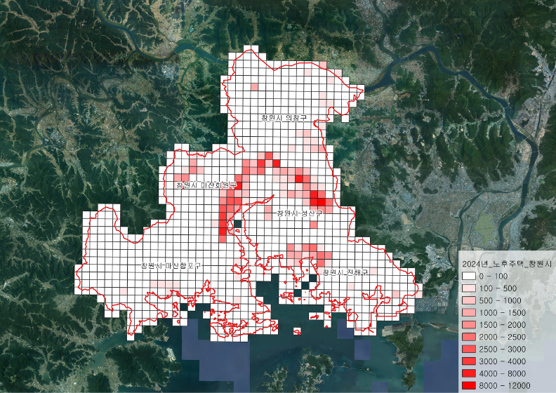
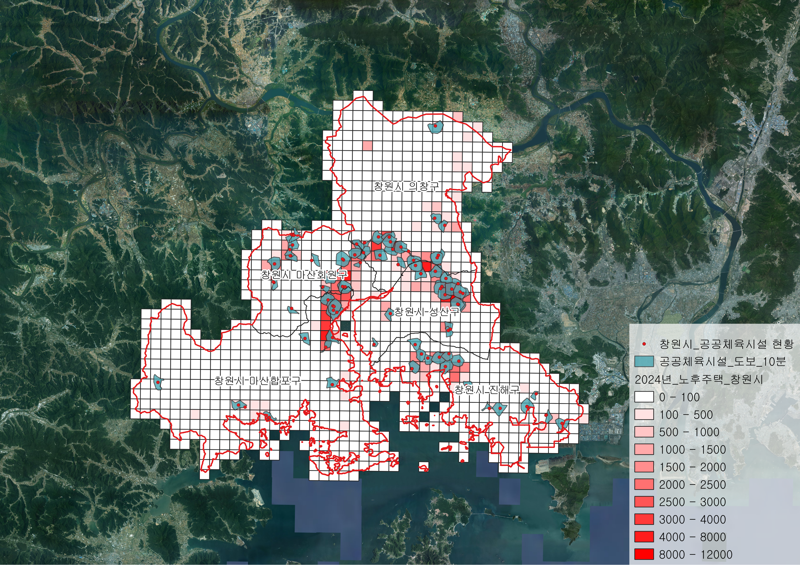
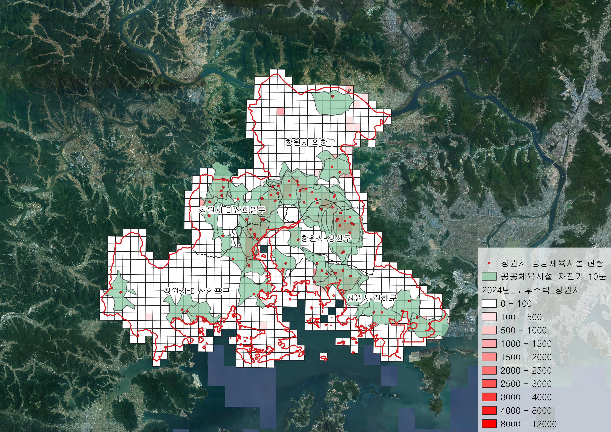
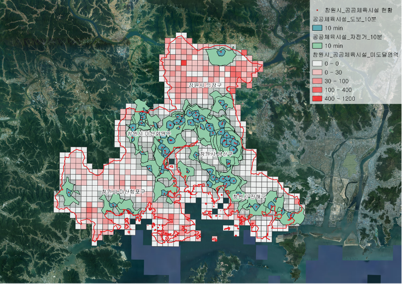

# 창원시 노후주택 공공체육시설 접근성 분석

## 분석 개요

KOSIS 통계에 따르면, 창원시는 전국 시군구 중 노후주택이 가장 많이 분포하고 있으며, 일부 지역에서는 공공체육시설이 부족하거나 시설 접근성이 낮은 지역이 존재하는 것으로 나타났습니다. 특히 노후주택 밀집지역은 상대적으로 생활편의시설이 부족할 가능성이 있어 거주민의 공공체육시설 접근성을 공간적으로 진단할 필요가 있습니다.

이에 본 분석에서는 창원시의 2000년 이전 건축 주택을 노후주택으로 정의하고 1km 격자 단위로 노후주택 분포를 구축하였습니다. 이후 ORS(OpenRouteService)를 활용하여 공공체육시설의 도보 및 자전거 10분 접근권역을 생성하고, 시설 접근권역에서 벗어난 노후주택 격자를 추출하였습니다. 이를 통해 공공체육시설 접근성이 취약하면서 노후주택이 밀집한 지역을 파악하고, 향후 체육시설 설치 및 생활체육 서비스 지원을 위한 기초자료를 마련하고자 하였습니다.

## 사용 데이터

| 데이터 | 출처 및 형태 |
| :--- | :--- |
| 창원시 공공체육시설 이용현황 | 공공데이터포털 CSV |
| 창원시 시군구·읍면동 경계 | SGIS 통계지리정보서비스 SHP |
| 창원시 1km 격자 경계 | SGIS 통계지리정보서비스 SHP |
| 2024년 주택 격자통계 | SGIS 통계지리정보서비스 CSV |

## 분석 과정

① **노후주택 데이터 구축**  
SGIS 주택 격자통계에서 건축연도가 2000년 이전인 주택을 추출하고, 격자별 노후주택 수를 합산하였습니다.

② **창원시 분석 격자 구축**  
여러 지도로 나누어진 1km 격자 경계를 병합한 후 창원시 행정구역과 교차하는 격자만 추출하였습니다.

③ **노후주택 공간분포 분석**  
창원시 격자와 노후주택 통계 데이터를 결합하고 노후주택 수를 기준으로 단계구분도를 작성하여 공간적 분포를 확인하였습니다.

④ **공공체육시설 접근권역 생성**  
공공체육시설 위치를 좌표화한 뒤 ORS의 Isochrones(도달가능영역) 기능을 활용하여 도보 및 자전거 기준 10분 이내 접근 가능한 영역을 생성하였습니다.

⑤ **공공체육시설 미도달 지역 추출**  
노후주택 격자와 공공체육시설 10분 접근권역을 중첩하여 접근권역과 겹치지 않는 노후주택 격자를 추출하였습니다.

⑥ **접근 취약지역 시각화 및 비교**  
공공체육시설 미도달 격자의 노후주택 수를 단계구분도로 표현하고, 노후주택이 집중된 주요 접근 취약지역을 확인하였습니다.

## 분석 결과

**창원시 노후주택 분포**  

**공공체육시설 도보·자전거 10분 접근권역**

 

**공공체육시설 미도달 노후주택 지역**

  

